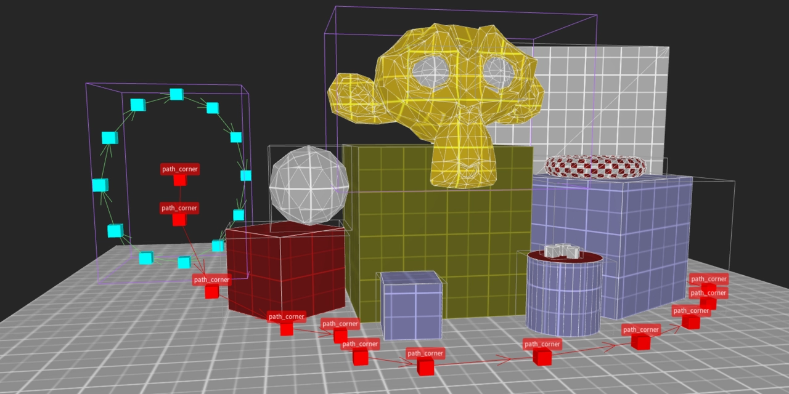
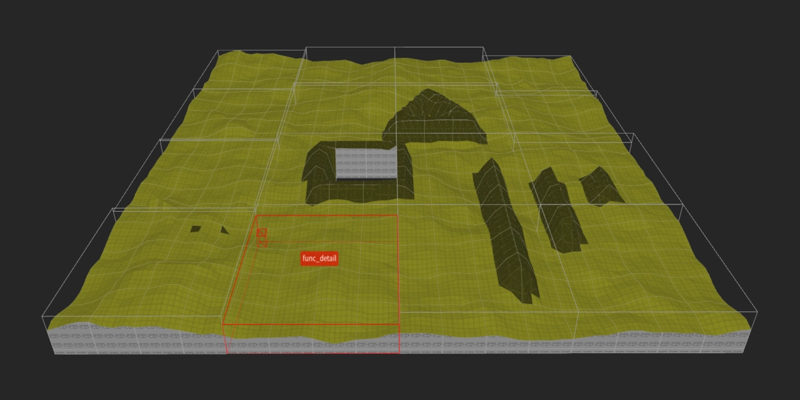

# Quake mapping tools

## Convert .obj scenes to maps
<br>

Any triangular mesh can be converted into convex brushes used in map files.<br>
This is achieved by extending a triangle into a pyramid along the back-facing normal.<br>
Alternatively, meshes that have "convex" in their name can be turned into big brushes.<br>
Scene materials are going to be discarded, unless a material list is provided.<br>
Objects might be split into different entities and grouped together.<br>
Line objects will be turned into **path_corner** entities.<br>
Run the script with ```--info``` option first.<br>

```Bash
python obj2map.py examples/scene.obj \
  --material_list "64_blue_2;64_green_2;64_gold_2;64_blood_2;64_grey_1" \
  --normal_offset 2.0 \
  --game Quake
```

## Convert heightmaps to maps
<br>

Seamless terrain generator with optional chunking for a faster compiling.<br>
Map format is poorly suited for storing large terrains with multiple textures.<br>

```Bash
python height2map.py examples/height.png \
  --material "64_green_1" \
  --chunk_size 16 \
  --game Quake
```
